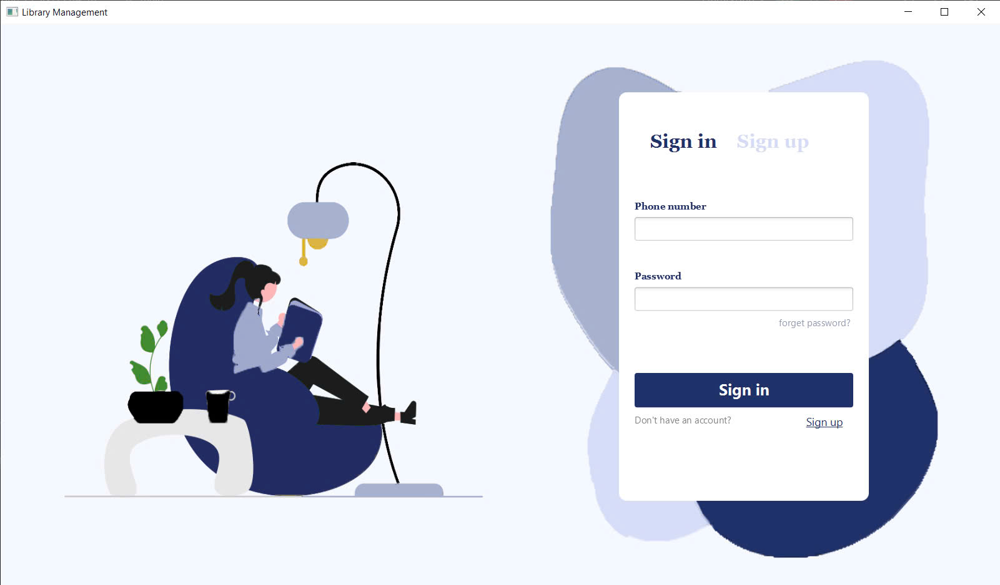
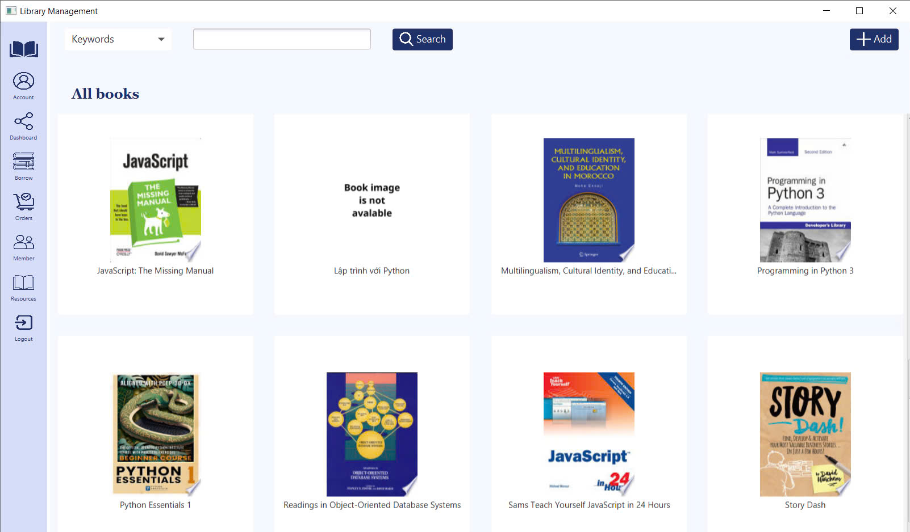
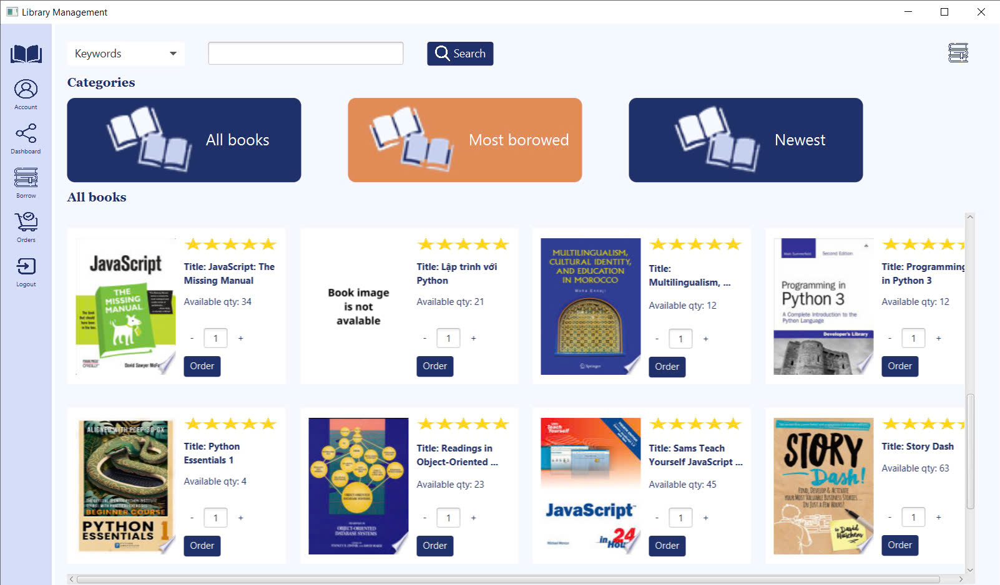
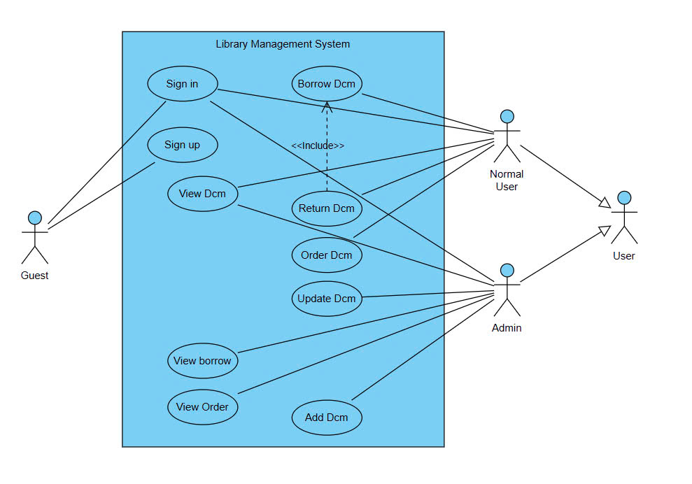

# Library Management System - Group 27
## Introduction

This is the final project for the Object-Oriented Programming course (INT2204_19) at the University of Engineering and Technology, VNU (UET), developed by Group 27. The Library Management System application is designed to provide a convenient and efficient solution for managing library operations. The project have 2 versions: **Command Line** & **Graphical User Interface**

## Authors

- Nguyễn Đức Dũng - 22022149 - [@nddungcoder](https://github.com/nddungcoder)
- Nguyễn Tiến Dũng - 22022113 - [@guin-D](https://github.com/guin-D)
- Vũ Anh Tuấn - 22022114 - [@moisterr](https://github.com/moisterr)

## Key Features

- **Admin:**
    - Manage all documents: view all documents, add new documents, delete documents and edit information of documents
    - Search document from database , search & add document using the document"s information from the Google Books API
    - Manage all information on book borrowing and purchasing
    - Manage all user(admin & normal user) like view information, delete account

- **Normal User:**
    - Can perform actions: view all documents, borrow documents, order documents and return documents
    - View borrowing and ordering history
    - Search document from database
    - Calculate fine if they return document late.

## Technologies Used

### Programming Language:
- **Java**: The core language used for application development

### Database:
- **MySQL**: Used to store and manage all library-related data, such as user accounts, document information, borrow and order history.

### Frameworks and Libraries:
- **JavaFX**: For creating Graphical User Interface (GUI) to enhance user experience.
- **JDBC** (Java Database Connectivity): To establish communication between the Java application and the database.

### Tools:
- **IntelliJ IDEA**: IDEs used for writing, debugging, and managing the codebase efficiently.
- **Git**: For version control and collaboration within the development team.
- **Maven**: For dependency management and project build automation.

### Additional Technologies:
- **JSON**: For data exchange and configuration files.
- **JUnit**: For testing and validating application components to ensure quality and stability.

## Screenshots

  

  

  

## Diagrams
- Use Case Diagram:

  

- Class Diagram:
[Class Diagram](https://drive.google.com/file/d/1I9tGl4Xp73EEQ4yLJpjcqXClYPsOSsLd/view?usp=sharing)
